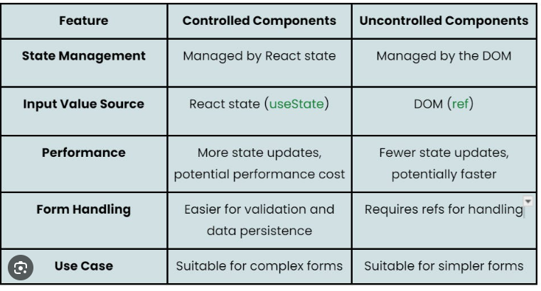

## Controlled components
Componentes en los que el componente padre es el responsable de manejar el estado del componente hijo, y luego es pasado al componente hijo a través de props.

**Ejemplo:** Un input de formulario donde el valor del input es manejado por el estado del componente padre, y cualquier cambio en el input actualiza ese estado.

## Uncontrolled components:
Son los componentes en los que el estado interno lo maneja el propio componente. Los datos del componente es tipicamente accedido cuando se necesita, o cuando un evento sucede. 

**Ejemplo:** Un formulario que no tiene su estado manejado por React, sino que se accede a los valores de los inputs cuando el usuario envía el formulario.



```jsx
// Uncontrolled - el valor está en el DOM
function UncontrolledInput() {
  const inputRef = useRef();
  
  const handleSubmit = () => {
    console.log(inputRef.current.value); // Lees del DOM
  };
  
  return <input ref={inputRef} />;
}
```


```jsx
// Controlled - el valor está en React state
function ControlledInput() {
  const [value, setValue] = useState('');
  
  const handleSubmit = () => {
    console.log(value); // Lees del estado de React
  };
  
  return <input value={value} onChange={e => setValue(e.target.value)} />;
}
```

Los ``controlled components`` son preferidos en React porque permiten un mejor control sobre el comportamiento del componente y facilitan la implementación de validaciones y otras lógicas relacionadas con el estado del componente. 

Sin embargo, los ``uncontrolled components`` pueden ser útiles en situaciones donde se requiere un manejo más simple y directo de los datos, o cuando se trabaja con librerías de terceros que no están diseñadas para integrarse con el estado de React.