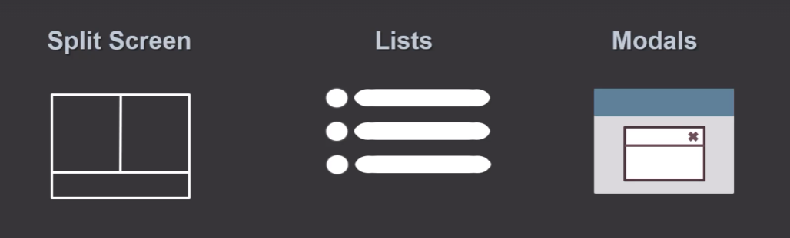

# Layout Components

Los componentes de layout son componentes especializados que se enfocan en organizar otros componentes en la página. Algunos ejemplos de componentes de layout muy comúnmente utilizados son:



- Pantallas divididas (Split Screens): múltiples componentes se organizan en diferentes secciones de la página
- Listas:
- Modales:

## Concepto fundamental detrás de los Layout Components:

Generalmente cuando desarrollamos un componente, solemos incluir en el mismo la estructura **HTML** (como por ejemplo `<div>`, `<h1>`, etc) y los estilos de cada uno de los elementos que usamos.

```html
<NavBar className="text-sm font-bold text-center">
  <h3>Hero</h3>
</NavBar>
```

_Con el uso de los Layout components tomamos un camino diferente:_ En un layout component, _separamos los estilos en un componente específico llamado Layout component_, e insertamos componentes específicos en el mismo. Esta separación nos ayuda a desacoplar la lógica del componente específico que estamos insertando en el Layout Component del con el estilo de los mismos, que se puede traducir por ejemplo en el posicionamiento de los componentes en la página


```jsx
// Layout Component - se encarga solo de los estilos
const CenteredNavLayout = ({ children }) => {
  return <div className="text-sm font-bold text-center">{children}</div>;
};

// Componente específico - se encarga solo de la lógica
const HeroComponent = () => {
  return <h3>Hero</h3>;
};

// Uso combinado
<CenteredNavLayout>
  <HeroComponent />
</CenteredNavLayout>;
```

**¿Qué beneficio nos otorga?**
El beneficio que obtenemos de esto, es que los componentes específicos que insertamos en el layout component -en el ejemplo de arriba sería `<HeroComponent />`-  **no se preocupan sobre su posicionamiento dentro de la página y tampoco tienen conocimiento de ello**. Con esto logramos algo muy importante que es que **nuestros componentes funcionan independientemente del lugar en el que se ubiquen en nuestra página**.